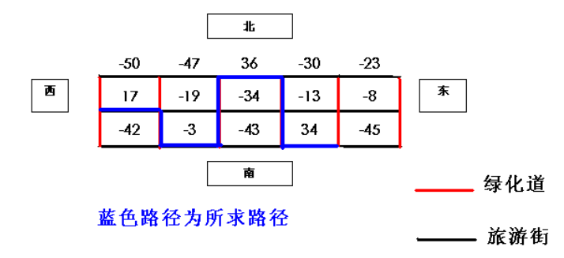

# <centre>周测一</centre>

## 一、题目概况

|题目名称|新斐波那契|开会|樱花|文件管理器|
|:---:|:---:|:---:|:---:|:---:|
|源程序文件名|`newfib`|`meeting`|`sakura`|`explorer`|
|输入文件名|`newfib.in`|`meeting.in`|`sakura.in`|`explorer.in`|
|输出文件名|`newfib.out`|`meeting.out`|`sakura.out`|`explorer.out`|
|每个测试点时限|$0.5s$|$0.5s$|$0.5s$|$0.5s$|
|测试点数目|$10$|$10$|$10$|$10$|
|测试点分值|$10$|$10$|$10$|$10$|
|运行内存上限|$1145MB$|$514MB$|$1145MB$|$1919MB$|

## 二、题目背景

`Sean`，`Weiwei`，`smartKevin`，`Tuffy`一起出去玩，路上遇到了许多问题。但是因为四个人都事一个一个的OI蒟蒻，解决不了，所以想请你来帮忙。

</br></br></br></br></br></br></br></br></br></br></br></br></br>

## 写在前面

这套题由四个真的OI蒟蒻出的题拼凑而成，难度大约在`普及/提高-`，欢迎各位神犇前来AK（卑微
并且已经`push`上了`github`，发现问题请及时提交`issues`
[**`github`仓库**](https://github.com/Sean-163/xcsy-2nd-junior-1st-test)

<div STYLE="page-break-after: always;"></div>

## 1.新斐波那契（`newfib.cpp`）

*by `Sean`*

### 题目描述

`Sean`在去玩的路上闲得慌，于是想出了一种新的斐波那契数列，其满足的递归关系不是简单的$\large{F_{n} = F_{n - 1} + F_{n - 2}}$，而是$\large{F_n = \sum_{i = 1}^{\frac{n}{k}}F_i}$。其中$\forall \large{i < 1}$，$\large{F_i} = 0$，$\large{i, k\in{\N+}}$ 且 $\large{k \neq 1 }$，$\large{\frac{n}{k}}$的运算结果向下取整。

现在给定$\large{n}$，$\large{k}$，以及第一项$\large{F_1}$，你的任务是求出$\large{F_n}$模$1e9+7$的值。

### 输入格式

仅一行，分别为正整数$\large{n}$，$\large{k}$与$\large{F_1}$，三者间由空格分隔

### 输出格式

仅一行一个数，为$\large{F_n}$的值

### 样例 #1

#### 样例输入 #1

```eg
5 2 4
```

#### 样例输出 #1

```eg
8
```

### 提示

对于$\large{50\%}$的数据，$\large{n \leqslant 500}$
对于$\large{100\%}$的数据，$\large{n \leqslant 2e4}$
输入数据保证$\large{F_i}$在长整型范围内

<div STYLE="page-break-after: always;"></div>

## 2.开会（`meeting.cpp`）

*by `Weiwei`*

### 题目描述

在路上，`Weiwei`的公司出现了一些事情，他得召集员工开会，员工的位置处于一条直线上，宛如一条数轴，`Weiwei`于是给他们编了坐标。员工分别具有一个速度。现在要找到一个坐标，使得最后一个员工到达那个位置的时间最小（可能到达有先后）。求出此时间。

### 输入格式

第一行为整数$\large{n}$，表示员工个数。
第二行给出$\large {n}$个整数$\large{x_i}$，表示员工坐标。
第三行给出$\large{n}$个整数$\large{v_i}$，表示员工速度。

### 输出格式

输出一个实数$\large{t}$，表示时间（保留五位小数）

### 样例 #1

#### 样例输入 #1

```eg
3
1 2 3
1 1 1
```

#### 样例输出 #1

```eg
1.00000
```

### 样例 #2

#### 样例输入 #2

```eg
3
1 3 7 
2 1 1
```

#### 样例输出 #2

```eg
2.00000
```

### 样例 #3

#### 样例输入 #3

```eg
10
1 3 4 5 8 11 12 14 15 18
4 3 9 2 4 6 8 3 2 3
```

#### 样例输出 #3

```eg
2.60000
```

### 样例 #4

#### 样例输入 #4

```eg
10 
2 3 5 7 11 13 17 19 23 29
6 5 4 3 2 1 2 3 4 5
```

#### 样例输出 #4

```eg
2.75000
```

### 提示

对于$\large{20\%}$的数据，$\large{ N \leqslant 10000,1 \leqslant x_i , v_i \leqslant 10000}$
对于$\large{100\%}$的数据，$\large{ N \leqslant 2500000,1 \leqslant x_i,v_i \leqslant 1000000000}$

<div STYLE="page-break-after: always;"></div>

## 3.赏樱（`sakura.cpp`）
*by `smartKevin`*
> 樱花落下的速度是每秒五厘米，我该用怎样的速度，才能与你相遇 ——《秒速五厘米》

>“Sakura最好了” ——《龙族》上杉绘梨衣

`smartKevin`一行人到达了此行的目的地，一条开满樱花的小街。

### 题目描述

开满樱花的街道成网格状。其中东西向的街道都是旅游街，南北向的街道都是林荫道。由于游客众多，旅游街被规定为单行道，游客在旅游街上只能从西向东走，在林阴道上则既可从南向北走，也可以从北向南走。 现在有$P$个人想到这个旅游区游玩。`smartKevin`给了他们一些建议，用分值表示所有旅游街相邻 两个路口之间的街道值得游览的程度，分值时从-100 到 100 的整数，所有林阴道不打分。所有分值不可能全是负分。例如下图是被打过分的某旅游区的街道图：



这$P$个人每人都有一个范围$L$和$R$，表示游客只能在$L$，$R$之间行动，他们可以任选起点和终点。请你写一个程序，帮助这$P$个人找一条最佳的游览线路，使得这条线路的所有分值总和最大。

### 输入格式

第一行是三个整数$\large{P}$，$\large{M}$和$\large{N}$，之间用一个空格符隔开，$\large{P}$表示有多少个人，$\large{M}$ 表示有多少条旅游街，$\large{N}$ 表示有多少条林阴道。接下来$\large{P}$行每行两个整数$\large{L}$，$\large{R}$ ,表示每位游客的$\large{L}$和$\large{R}$。接下来的$\large{M}$行依次给出了由北向南每条旅 游街的分值信息。每行有$\large{N}$个整数，依次表示了自西向东旅游街每一小段的分值。同一行相邻两个数之间用一个空格隔开。

### 输出格式
$\large{P}$行，每行一个整数，表示这$\large{P}$个游客的最佳游览线路的分值。
### 样例 #1
#### 样例输入 #1
```eg
2 3 5
1 5
2 3
-50 –47 36 –30 –23
17 –19 –34 –13 –8
-42 –3 –43 34 –45
```
#### 样例输出 #1
```eg
84
36
```

### 样例 #2
#### 样例输入 #2
```eg
1 1 6
1 6
1 -1 4 5 -1 4
```
#### 样例输出  #2
```eg
12
```

### 提示

$\large{1 \leqslant M \leqslant 100}$
$\large{1 \leqslant N \leqslant 100001}$
$\large{1 \leqslant L, R \leqslant N}$

<div STYLE="page-break-after: always;"></div>

## 文件管理器（`explorer.cpp`）
*by `Tuffy`*

### 题目描述

`Tuffy`提议开发一种名为`TuffyOS`的新系统，将今天游玩所得的资料存储上去。开发一个系统第一个要做的事就是做文件管理器。可是正如之前所说，`Tuffy`是个蒟蒻，所以找到你来帮忙。

因为`Tuffy`不会写硬盘分区，所以盘符一定为`T:`
而且`Tuffy`不会写`B树`，所以文件夹不会重名

这个文件夹管理器应该具备以下五种功能：

##### `start`

创建`T:`盘符，并输出`start=>OK`

##### `create <path>`

如果路径不存在，循环创造该路径，并且输出`create=>OK`
如果存在或重名，输出`create=>ERROR`

##### `list <path>`

如果路径存在，先列出该路径第一层根目录下的文件个数
再以创建顺序输出第一层根目录下的所有文件路径，一行一个，并输出`list=>OK`
如果不存在，输出`list=>ERROR`

##### `find <name>`

寻找该名字的路径，如果存在，输出`find=>OK`并紧跟一行该文件的路径
如果存在多个符合要求的文件，按字典序输出，每行一个路径
如果名字不存在，输出`find=>ERROR`

##### `end`

先输出一行文件总个数(根目录也算在内）
再以字典序输出根目录下所有文件的路径，一行一个，并输出`end=>OK`

### 输入格式

每个命令占一行，且一定会以`start`开始，以`end`结束。
每个文件夹的名称皆为非负整数，且小于等于$\large 9999$

### 样例 #1
#### 样例输入 #1
```eg
start
create T:\114\514
create T:\19\1\9810
list T:\114
find 9810
end
```

#### 样例输出 #1

```eg
start=>OK
create=>OK
create=>OK
1
T:\114\514
list=>OK
find=>OK
T:\19\1\9810
6
T:\19\1
T:\114
T:\19
T:\114\514
T:\19\1\9810
T:
end=>OK
```

### 提示

设$\large{T}$为命令总数，$\large{D}$为路径深度
对于$\large{40\%}$的数据，$\large{T \leqslant 100, D \leqslant 10}$
对于$\large{100\%}$的数据$\large{T \leqslant 5000, D \leqslant 500}$

<div STYLE="page-break-after: always;"></div>

## 后记
本文档采用`markdown`写作，`Typora`编译生成
这套题确实要素过多，包括但不限于：

* `CCF`传统第三题比第四题难
* 四个人都是一个一个的HOMO啊啊啊啊啊啊
* 有一个线段树魔怔人，我不说是谁
* 还有一个考`trie`，然后改成`STL`的，我也不说是谁

总而言之，这题可能难度不止普通普及（悲
不过也没有那么难

祝看到这里的`OIer`们早日AK！